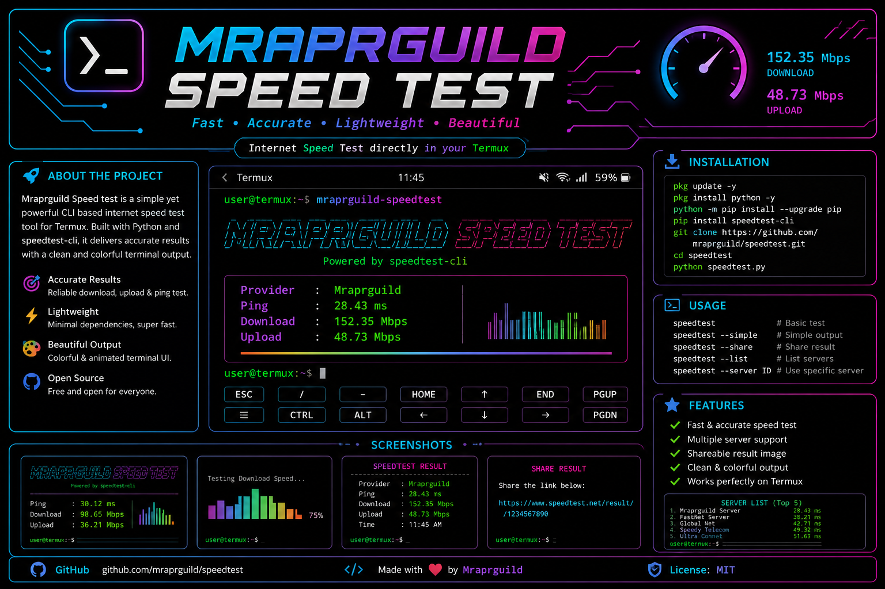

<div align="center">


<br>


# ⚡ Mraprguild Speed Test

### A modern, animated and self-hosted network speed-test dashboard for Termux

[](https://github.com/Mraprguild)


**Fast · Private · Lightweight · Responsive · Open Source**

</div>

---

## 🌌 Project Preview

<div align="center">
  
</div>

> [!IMPORTANT]
> This project measures the connection between the browser and the server running inside Termux.  
> Testing on the same phone measures local browser/server performance. Testing from another device on the same Wi-Fi measures LAN and Wi-Fi performance.

---

## ✨ Main Features

<table>
<tr>
<td width="50%">

### 🚀 Network Testing

- Real-time download speed
- Real-time upload speed
- Ping measurement
- Jitter calculation
- Animated speed gauge
- Multiple test rounds
- Live progress messages

</td>
<td width="50%">

### 🎨 Interface Design

- Cyber-neon color system
- Cyan, purple, pink and green accents
- Responsive mobile layout
- Smooth gauge transitions
- Glass-style cards
- Dark terminal-inspired background
- Mraprguild branding

</td>
</tr>
<tr>
<td>

### 🔐 Privacy

- No account required
- No database required
- No permanent IP logging
- Uploaded test data is discarded
- Download data is generated in memory
- Can run completely inside a private LAN

</td>
<td>

### 🛠️ Server Tools

- Flask threaded server
- Health-check endpoint
- Configurable application name
- Configurable host and port
- Termux install script
- Start and update scripts
- GitHub-ready project structure

</td>
</tr>
</table>

---

## 🎨 Theme Colour System

| Element | Colour | Hex |
|---|---|---|
| Main background | Deep Space Black | `#050A12` |
| Dashboard panel | Midnight Navy | `#0B1422` |
| Secondary panel | Dark Blue | `#101C2C` |
| Primary neon | Electric Cyan | `#25E7FF` |
| Success accent | Matrix Green | `#4CFF9D` |
| Highlight accent | Neon Pink | `#FF37C7` |
| Purple accent | Cyber Purple | `#A855F7` |
| Main text | Ice White | `#E8F4FF` |
| Muted text | Steel Blue | `#7990A8` |
| Border line | Deep Cyan Gray | `#1C3045` |

### CSS colour variables

```css
:root {
  --background: #050a12;
  --panel: #0b1422;
  --panel-secondary: #101c2c;
  --text: #e8f4ff;
  --muted: #7990a8;
  --cyan: #25e7ff;
  --green: #4cff9d;
  --pink: #ff37c7;
  --purple: #a855f7;
  --line: #1c3045;
}
```

---

## 🎞️ Animation Design

The dashboard uses lightweight CSS and JavaScript animation instead of heavy UI frameworks.

### Included effects

- Animated semicircle speed gauge
- Smooth speed-value updates
- Neon glow around the active gauge
- Gradient start button
- Live test-phase status
- Responsive card transitions
- Animated SVG README banner
- Terminal-style visual presentation

### Gauge animation

```css
.arc {
  stroke: var(--cyan);
  stroke-dasharray: 267;
  stroke-dashoffset: 267;
  filter: drop-shadow(0 0 9px var(--cyan));
  transition: stroke-dashoffset 0.2s;
}
```

JavaScript changes the dash offset while data is downloaded or uploaded:

```javascript
function setGauge(value, phase, max = 100) {
  const safe = Math.max(0, Math.min(value, max));
  speed.textContent = Number(value).toFixed(2);
  arc.style.strokeDashoffset =
    String(267 - (safe / max) * 267);
}
```

---

## 📦 Requirements

- Android device
- Termux from F-Droid or GitHub
- Python 3
- Git
- A modern browser
- Wi-Fi or mobile network

---

## ⚙️ Install in Termux

### Method 1 — GitHub installation

```bash
pkg update -y
pkg upgrade -y
pkg install git python -y

git clone https://github.com/Mraprguild/mraprguild-speed-test.git
cd mraprguild-speed-test

bash install.sh
./start.sh
```

### Method 2 — ZIP installation

```bash
pkg update -y
pkg install python unzip -y

unzip mraprguild-speed-test.zip
cd mraprguild-speed-test

bash install.sh
./start.sh
```

---

## 🌐 Open the Dashboard

### Same Android phone

```text
http://127.0.0.1:8080
```

### Another device on the same Wi-Fi

```text
http://PHONE_LOCAL_IP:8080
```

The startup script automatically prints the detected network address.

Example:

```text
Starting Mraprguild Speed Test
Phone: http://127.0.0.1:8080
Wi-Fi: http://192.168.1.8:8080
Stop:  CTRL+C
```

---

## 🧪 How the Test Works

### Ping

The browser sends several small requests to `/api/ping`. The median response time becomes the displayed ping.

### Jitter

Jitter is calculated from the average difference between consecutive ping measurements.

### Download

The server generates random bytes in memory and streams them through `/api/download`. The browser measures transferred bytes against elapsed time.

### Upload

The browser creates a binary payload and sends it to `/api/upload`. The server reads the data and immediately discards it.

### Speed formula

```text
Mbps = transferred bytes × 8 ÷ elapsed seconds ÷ 1,000,000
```

---

## 🗂️ Project Structure

```text
mraprguild-speed-test/
├── assets/
│   ├── termux-header.png
│   ├── mraprguild-speed-test.png
│   └── typing-banner.svg
├── static/
│   ├── app.js
│   └── style.css
├── templates/
│   └── index.html
├── server.py
├── install.sh
├── start.sh
├── update.sh
├── requirements.txt
├── LICENSE
├── .gitignore
└── README.md
```

---

## 🔌 API Endpoints

| Endpoint | Method | Description |
|---|---:|---|
| `/` | GET | Loads the speed-test dashboard |
| `/api/ping` | GET | Returns a lightweight latency response |
| `/api/download` | GET | Streams generated test data |
| `/api/upload` | POST | Receives and discards test data |
| `/api/info` | GET | Returns client and application information |
| `/health` | GET | Returns the server health status |

### Health-check example

```bash
curl http://127.0.0.1:8080/health
```

Response:

```json
{
  "status": "ok"
}
```

---

## 🔧 Configuration

### Change the port

```bash
PORT=9090 ./start.sh
```

Open:

```text
http://127.0.0.1:9090
```

### Change the dashboard name

```bash
APP_NAME="My Private Speed Test" ./start.sh
```

### Change name and port

```bash
APP_NAME="Mraprguild Network Lab" PORT=9090 ./start.sh
```

### Permanent configuration

Edit `start.sh`:

```bash
export APP_NAME="Mraprguild Speed Test"
export PORT="8080"
```

---

## 🎨 Theme Customization

### Change primary cyan colour

Open:

```text
static/style.css
```

Replace:

```css
--cyan: #25e7ff;
```

Example green theme:

```css
--cyan: #39ff14;
```

### Change the page title

Open:

```text
templates/index.html
```

Edit:

```html
<title>{{ app_name }}</title>
```

### Change the footer

```html
<footer>
  Built for Termux · © Mraprguild
</footer>
```

### Change gauge limits

Open `static/app.js` and edit:

```javascript
setGauge(mbps, "Downloading", 200);
setGauge(mbps, "Uploading", 100);
```

For a faster connection:

```javascript
setGauge(mbps, "Downloading", 1000);
setGauge(mbps, "Uploading", 500);
```

---

## 🖥️ Keep the Server Running

Install `tmux`:

```bash
pkg install tmux -y
```

Create a session:

```bash
tmux new -s speedtest
./start.sh
```

Detach:

```text
CTRL + B
D
```

Reconnect:

```bash
tmux attach -t speedtest
```

List sessions:

```bash
tmux ls
```

Stop the session:

```bash
tmux kill-session -t speedtest
```

---

## 🔄 Update the Project

```bash
cd mraprguild-speed-test
./update.sh
```

Manual update:

```bash
git pull --ff-only
source .venv/bin/activate
python -m pip install -r requirements.txt
```

---

## 🌍 Public Server Deployment

For real internet testing, deploy the project on a VPS or another server with enough bandwidth.

> [!WARNING]
> Temporary tunnels can add latency, bandwidth limits and routing overhead. Their results may not represent the real network speed.

A reverse proxy should forward these routes without response buffering:

```text
/
/api/ping
/api/download
/api/upload
/api/info
/health
```

Recommended public deployment components:

- HTTPS
- Nginx or Caddy
- Gunicorn or another production WSGI server
- Firewall rules
- Rate limiting
- Sufficient monthly bandwidth

---

## 🛡️ Security Notes

- Do not expose the Termux server publicly without understanding the risks.
- Use HTTPS for public deployment.
- Apply firewall and tunnel restrictions.
- Avoid running the service as a privileged user.
- Monitor data usage because speed tests can transfer large payloads.
- Keep Termux and Python dependencies updated.
- Only install project files from a trusted repository.

---

## 🧰 Troubleshooting

<details>
<summary><b>Permission denied</b></summary>

```bash
chmod +x install.sh start.sh update.sh
```

Then:

```bash
./start.sh
```

</details>

<details>
<summary><b>Virtual environment missing</b></summary>

```bash
rm -rf .venv
bash install.sh
```

</details>

<details>
<summary><b>Port already in use</b></summary>

```bash
PORT=9090 ./start.sh
```

</details>

<details>
<summary><b>Another device cannot open the server</b></summary>

1. Connect both devices to the same Wi-Fi.
2. Keep Termux open.
3. Use the Wi-Fi URL shown by `./start.sh`.
4. Disable router client isolation when enabled.
5. Temporarily disable a VPN that blocks local-network access.
6. Confirm that the phone did not switch to mobile data.

</details>

<details>
<summary><b>Flask module not found</b></summary>

```bash
source .venv/bin/activate
python -m pip install -r requirements.txt
```

</details>

<details>
<summary><b>Speed result appears incorrect</b></summary>

- Run the test several times.
- Stop background downloads.
- Disable battery saver.
- Move closer to the Wi-Fi router.
- Avoid VPN and proxy connections.
- Increase test payload size for very fast networks.
- Use a public high-bandwidth server for internet tests.

</details>

---

## 🧑‍💻 GitHub Repository Setup

```bash
git init
git add .
git commit -m "Initial release: Mraprguild Speed Test"
git branch -M main
git remote add origin https://github.com/Mraprguild/mraprguild-speed-test.git
git push -u origin main
```

---

## 🧭 Development Commands

Activate the environment:

```bash
source .venv/bin/activate
```

Run the server directly:

```bash
python server.py
```

Check Python syntax:

```bash
python -m py_compile server.py
```

Check server status:

```bash
curl http://127.0.0.1:8080/health
```

Stop the server:

```text
CTRL + C
```

---

## 🗺️ Roadmap

- [x] Ping test
- [x] Jitter test
- [x] Download test
- [x] Upload test
- [x] Responsive neon dashboard
- [x] Termux installer
- [x] Configurable server name and port
- [ ] Test history chart
- [ ] Export result as image
- [ ] Light and dark theme selector
- [ ] Multi-server selection
- [ ] Docker deployment
- [ ] Optional authentication
- [ ] PWA installation support

---

## 🤝 Contributing

1. Fork the repository.
2. Create a new branch.
3. Add or improve a feature.
4. Test the project in Termux.
5. Commit your changes.
6. Open a pull request.

```bash
git checkout -b feature/new-feature
git add .
git commit -m "Add new feature"
git push origin feature/new-feature
```

---

## 📄 License

This project is available under the **MIT License**.

You may use, modify and distribute the project while keeping the copyright and license notice.

---

## 👑 Author

<div align="center">

### Created by Mraprguild

[](https://github.com/Mraprguild)

```text
Powerful Terminal · Limitless Possibilities
```

**Made with ❤️ for the Termux community**

</div>
